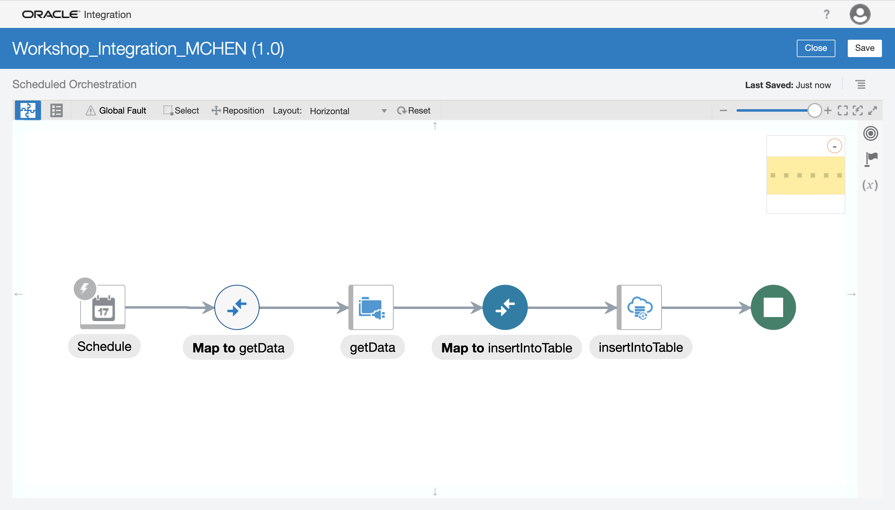
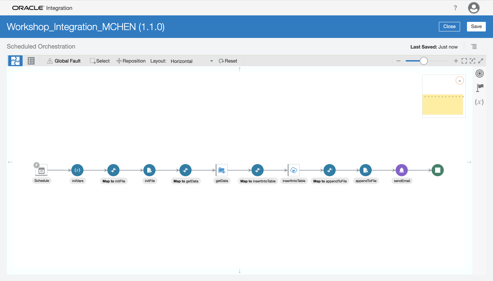
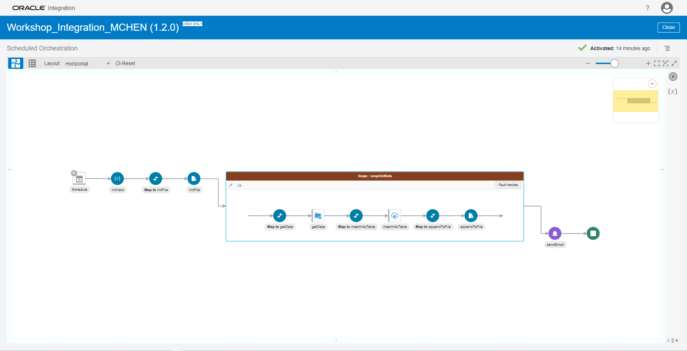

# Lab Instructions

## Prerequisites

- Set up your tenancy user. You should have received an email about a password reset for the Oracle Cloud workshop tenancy (the tenancy name is **thevanguardgroup**). Click the link in the email, provide a password, and you should be good to go. If you do not know your username, or if you did not receive a password reset email, please let one of the workshop instructors know.
- Make sure you are able to log in to Oracle Integration Cloud (OIC). Your workshop instructor will provide you the link to the **OIC home page** and show how to navigate to this home page from within the cloud console (cloud.oracle.com).
- Once you are able to log in to OIC, make sure you can create a connection and an integration. You don't need to actually create these artifacts, you just need to confirm that when you click "Create" in the upper right corner, a dialog box pops up and you don't receive a yellow banner notification saying "unauthorized" or something similar.

With these prerequisites checked you are good to go!

## Section 0: Setup

There are a few crucial steps prior to being able to successfully create all parts of this integration. Please complete these steps in their entirety.

### **Step 1: Retrieve the ATP Wallet File**

Prior to connecting to ATP, you will need the wallet file. **You will not need to access the OIC home page for this step.** If you are unable to complete this step, you can download the wallet file from the repository [here](Wallet_DB202105022139.zip).
1. Log in to the Oracle Cloud Infrastructure (OCI) console at **[cloud.oracle.com](https://cloud.oracle.com)**.
2. Click the hamburger menu `Ξ` (looks like three stacked horizontal lines) in the upper left corner, click **Oracle Database**, and select **Autonomous Transaction Processing**.
3. On the left, change the **compartment** to the compartment `OIC_Labs`. Then, click on the ATP instance called `workshopDB`. _Make sure your region is "US East (Ashburn)" or you will not see the instance._
4. Click the **DB Connection** button. Keep the wallet type as "Instance Wallet", then click **Download Wallet**. This will give you a pop-up wizard to download the wallet. Add a password for the wallet. **Remember this password, as you will use it to create the connection later in [section 1](#section-1-basic-integration).**
You may use [SQL Developer](https://www.oracle.com/database/technologies/appdev/sqldeveloper-landing.html) or other DB applications to connect to the autonomous database.

## Section 1: Basic Integration

In this section, you will learn how to set up an integration that pulls data from a file server and inserts that data into a database. It is our objective to make sure every lab attendee is able to complete this integration. Here is a diagram of the integration you will build:


### **Step 1: Create the ATP Connection**

Now that you have the wallet file, you can create the connection to ATP.
1. Navigate to the integration home page: from [cloud.oracle.com](https://cloud.oracle.com), click on the hamburger menu, then on **Developer Services**, and select **Integration** under Application Integration. Change the compartment to `OIC_Labs` if it is not already set to that, then click on **OIC_workshop**. Finally, click on the **Service Console** to navigate to the home page. In the future, you can directly access the link for this home page if you have it saved somewhere. _We recommend that you bookmark OIC home pages such as this one._
2. Click the hamburger menu in the upper left corner and select **Integrations > Connections**.
3. **Create** a connection (upper right corner), then after the dialog box pops up, search for `ATP` and select the `Oracle ATP` adapter.
4. In the wizard, give the connection a name and leave the other options at their default. We recommend that you add your name to the connection name to differentiate it from connections created by other workshop attendees. Then click **Create**.
5. Perform the following:
   - In the security section, click the upload button (square button with up arrow) and upload the wallet file you downloaded. This should be the entire zip file called `Wallet_DB202105022139.zip`.
   - For the **Wallet Password**, type the password you provided when you downloaded the wallet file.
   - For the **Database Service Username**, type `ADMIN`.
   - For the **Database Service Password**, your workshop instructor will provide you with the admin password.
   - Finally, right above the security section, for the not-so-optional "Service Name (optional)" enter `db202105022139_high`. _Note: to locate a list of valid service names, unzip the wallet file, then open the tnsnames.ora file using a text editor._
6. Once you are done with the above, click **Test**. The connection should give you a green banner notification, and the connection should show as 100% configured (100% in a blue oval).
7. **Save** your connection. Then return to the connection list screen by clicking the white chevron `<` in the upper left corner.

### **Step 2: Create the FTP Connection**

Here you will connect to the embedded file server on OIC. You can read more about it in [this blog post](https://blogs.oracle.com/integration/embedded-file-server-sftp-in-oracle-integration). If you are unable to access the File Server settings, your lab instructor will provide you with the IP address and port of the FTP server.
1. In order to connect to the FTP server, you will need the **FTP Server Host Address** and **FTP Server Port** of the embedded file server on OIC. Navigate to your OIC home page, click the hamburger menu in the upper left corner, then select **Settings > File Server > Settings**.
2. While the settings are loading, **open a new tab** and navigate to your OIC home page. Click the hamburger menu in the upper left corner and select **Integrations > Connections**. Once again, **create** a connection, then after the dialog box pops up, search for `FTP` and select the `FTP` adapter.
3. In the wizard, give the connection a name and leave the other options at their default. We recommend that you add your name to the connection name to differentiate it from connections created by other workshop attendees. Then click **Create**.
4. Perform the following:
   - For the **FTP Host Server Address**, type in the IP address of the embedded file server.
   - For the **FTP Server Port**, type in the port number of the embedded file server.
   - For the **SFTP Connection**, select `Yes`.
   - In the security section, keep the **Security Policy** as `FTP Server Access Policy` and fill in your IDCS credentials for the **User Name** and **Password**. _Note: these are the same credentials you used to log in to Oracle cloud as your login is federated to IDCS._
5. Once you are done with the above, click **Test**, and then one of the two **Test** options. Once again, if you see the 100%, everything is configured properly.
6. **Save** your connection. Then return to the connection list screen by clicking the white chevron in the upper left corner.

### **Step 3: Initialize the integration**

This step initializes the integration that you will build on throughout the hands-on portion.
1. Click the hamburger menu in the upper left corner and select **Integrations**.
2. **Create** an integration (upper right corner), then after the dialog box pops up, select `Scheduled Orchestration`.
3. In the wizard, give the integration a name, then click **Create**. We continue to recommend that you add your name to the integration name to differentiate it from integrations created by other workshop attendees. Then click **Create**. _Note: for a better integration experience, we recommend you change the layout to "horizontal" and to click the reset button if your integration becomes too messy._

### **Step 4: Invoke FTP to retrieve data**

This step sets up the invocation of FTP to retrieve all data from the file. Our target file is called **[person.csv](person.csv)**. Please download this file as you will need it in this step.
1. Hover your cursor over the grey arrow from the schedule to the stop element, and **click the plus**. Select the FTP connection you configured.
2. In the wizard, give the invocation a name. These names only have to be unique within the integration, so they can be generic like `getData`. Click **Next**.
3. Leave the **operation** as `Read a File`. Leave the file format as **binary**. For the **Input Directory**, enter `/workshop`, and for the **File Name**, enter `person.csv`. Click **Next**.
4. Leave the default settings for this page (`Yes` and `Sample delimited document`). Click **Next**.
5. Upload [person.csv](person.csv) for the **Delimited Data File**. For the **Record Name**, enter `record`, and for the **Recordset Name**, enter `recordSet` (the exact name doesn't matter, they are variable names for the mapper). Leave everything else as is, then click **Next**. _Note: even though this is the entire file you will be processing in your integration (8 names), only the headers are required. So you could upload a modified version of person.csv that consists solely of the headers and that would work too._
6. You may review some summary information about the ftp connection configuration. Click **Done**.

***Save your integration.***

### **Step 5: Insert data into ATP**

This step inserts the data into ATP.
1. Hover your cursor over the grey arrow between `getData` and the stop element; click the plus. It might help to click **Reset** to re-position all the elements in the integration. Select the ATP connection you configured.
2. In the wizard, give the invoke a name (for instance, "insertIntoTable"). For the **operation to perform**, select `Perform an Operation On a Table`, and select `Insert`. Click **Next**.
3. Select `ADMIN` as the **Schema** and **search** for the table called `WORKSHOP`. Once you have located the table, you may double-click it or single-click and click the single right chevron to add it to the right side. Then click **Import Tables**.
4. There are no more actions to perform, and the remaining pages are there to show information. Click **Next** and **Done**.
5. Select the **Map to insertIntoTable**, and click on the pencil icon to **edit** the mapper.
6. On the left hand side (LHS), expand **_getData_ Response > SyncReadFileResponse > FileReadResponse > RecordSet**, which should contain a single **record** variable. Drag **record** to **Workshop**. This should create a line from **record** to **Workshop**, indicating that a mapping was created between the two objects. _Note: since both **record** and **Workshop** are container objects that consist of primitive variables, the mapping actually doesn't map any data. It only generates a "foreach" operator in the XSLT definition of the map._
   - _Note: in case you don't see the "getData Response" element, look for just "Response" as the name of the element is the same as the name of the FTP element you configured in the previous step (so if you gave it a name of "readFile" you would look for "readFile Response")._
7. Now to map the variables within both objects. Click **XSLT** (easiest way is just ctrl+F or cmd+F to search for XSLT), then on the RHS expand **for-each > Workshop**. Also, on the LHS, expand **record**. Map all of the LHS variables to the RHS variables, so `record.Fname` to `Workshop.fname`, and so on.
8. You will need to hard-code the `timestamp` and `createdBy` variables. Right-click on the `timestamp` variable, and select `Create Target Node`. An expression box should appear on the bottom if it has not already. Click the wrench+screwdriver icon (right side under the x) to enable editing of the expression. Enter this code as the expression: `fn:current-dateTime()`. Then click the check symbol (under the wrench+screwdriver) to save this expression.
9. Create a target node for the `createdBy` variable and enter your name surrounded by quotes. For instance: `"John Doe"`.
10. Once you have completed all mappings, click **Validate** at the top right of the screen, then **Close**.

***Save your integration.***

### **Step 6: Activate integration**

This step goes through the process of activating and testing integrations.
1. First, you will need to resolve any errors in the integration. The only error that should appear is one related to tracking. This error is resolved by **enabling a tracking variable** for the integration. Click the menu under the save button and select **Tracking**.
   - You can see how many errors/warnings there are by a red/blue circled number next to "Last Saved".
2. Expand the **schedule** variable, and drag the `startTime` variable over the first **Drag a trigger field here**. Instead of dragging you can also click the `startTime` variable and click the single right chevron. Click **Save**.
   - If you still have additional warnings/errors, please contact a workshop instructor to help you resolve these issues. You can click the red/blue circled number and hover over the entries to view the errors.
3. Now your integration is ready for activation. **Save your integration**, then click **Close**. This brings you back to the integration home screen, and you can see that your status has changed from "Draft" to "Configured". Hover your cursor over your integration and click the "Power Button".
4. In the dialog box, check the box for "Enable Tracing", and also the box for "Include Payload". Then click **Activate**. _Note: the boxes for "Enable Tracing" and "Include Payload" are generally only checked when testing an integration, as they tend to reveal sensitive/confidential information. Also, here we could create a schedule if we wanted to by clicking **Activate and Schedule**, but as we will never use the schedule, it is simpler to skip that step._

Now your integration is active, and you can run it to perform business operations.

### **Step 7: Run and monitor integration**.

This step shows how to manually trigger an integration and how to debug integrations.
1. Hover your cursor over your integration and click the "Play Button". Then click **Submit Now**.
2. Confirm that "Ad hoc request" is selected, then click **Submit Now**.
3. Now, the integration will run and either complete or throw an error during execution. To view the "job" that was just initiated, navigate back to the **OIC home page**, then go to **Monitoring > Integrations > Tracking**.
4. In this page, you will see integrations that have completed execution. It is likely that your integration has already executed and given a success or error. Drill down into the integration run by clicking on the black text (here, it is "start Time: 2021-..."). _If you do not see the most recent job you initiated, the filters might be too strict. Click **clear** to remove all filters and view all integrations executed within the last hour._
5. In this page, you will see the execution pathway highlighted in green. For most integrations, the structure is linear enough that it is not really interesting to look at (unless there is an error), but the green pathway is useful for complex integrations that use branching logic and "fault handlers" (basically a try-catch code block).
6. Now you will take a look at the activity stream. Click the menu icon under the "Close" button in the upper right corner, and select **View Activity Stream**. You can click on the **Message**s to view the payloads that were sent (enabled by checking the "Include Payload" option when activating the integration). _Note: should this integration run have resulted in an error, at the end of the activity stream it will show the error message. If you ran into one of these, please contact your workshop instructor._

That's it! For some of you, you will have built your first integration on Oracle Integration Cloud!

## Section 2: Sending a notification and building a file

This section is optional, and it builds on section 1. Attendees who complete section 1 are strongly encouraged to move on to this section and finish as much of it as they can. You will create a new version of your integration, then add enhancements to it. Here is a diagram of the integration you will build:


### **Step 1: Initialize file and variables**

In this step, you will generate a file in OIC and make use of variables in your integration to simplify the workflow.
1. Navigate to the **OIC home page**, then select **Integrations > Integrations**. Hover over the **integration you completed in section 1**. This should have version number `01.00.0000`. Click the "Menu" button, then **Create New Version**. Since you will make a **minor** change in this section, you will assign a new version number of `01.01.0000`. Notice that you now have two integrations created by you: one still-active v1.0.0, and one "configured" v1.1.0.
2. Enter the newly spawned integration. In your integration, add an **Assign** action right after the `Schedule` element. (Hover your cursor over the grey arrow between `Schedule` and `Map to getTable`. Search for `assign` and select the **Assign** action. In the dialog pop up box, give it a name (for instance `initVars`) and click **Create**.)
3. Click the lower-right plus to add a variable. Change the `initVars_assignment_1` variable name to `FILENAME`. Then, click the pencil icon to give this variable a value. For the Expression, you will simply write `"person.csv"`, quotation marks included, then **validate** and **close** out of the expression builder. _Make sure the quotation marks are "unformatted", i.e. not the so-called “smart quotation marks”._ Add another variable called `FILEDIR` with value `"/workshop"`. Once you are done, click **Close**.
4. Right after `initVars`, add a **Stage File** action.
5. In the wizard, give the action a name, for instance `initFile`, and click **Next**.
6. **Choose** the **Stage File Operation** to be **Write File**. For the **file name**, click the pencil icon, and drag `$FILENAME` to the expression box (or use the chevron). Then click **Save** and **Exit Expression Builder**. Do the same thing for **output directory**, except using the variable `$FILEDIR` this time. Then click **Next**.
7. Ensure that you want to specify the structure of the contents of the file as CSV, then click **Next**.
8. For the **delimited data file**, choose [person_buildfile.csv](person_buildfile.csv). The **record name** can be `record`, and the **recordset name** can be `recordSet`. Then click **Next**.
9. Click **Done**.
10. Select the **Map to initFile** element, and click the pencil icon to **edit** the mapper.
11. On the RHS, expand **recordSet > record**. For each of the secen variables, right-click on them and select **Create Target Node**. This allows you to edit the expression for this variable without using a LHS variable. Edit the expression (clicking the wrench-screwdriver icon) and enter the variable name in quotes, so for `Fname` the expression would be `"Fname"`, etc. Once this is done, **Validate** and **Close** the mapper.

***Save your integration.***

### **Step 2: Modify `getData` to use the variables created**

Recall that the `getData` element had a hard-coded directory and name. You will modify the `Map to getData` element to use the variables created in [step 1](#step-1-initialize-file-and-variables).
1. Select the `Map to getData` element, and click the pencil icon to **edit** the mapper.
2. Open **FileReadRequest** on the RHS. Drag `$FILENAME` to `filename`, and `$FILEDIR` to `directory`. _Even though the filename and directory variables are still the same as before in the `getData` element, they will be overwritten at runtime._
3. **Validate** and **Close**.

***Save your integration.***

### **Step 3: Append to file**

In this step, you will append data to the file you initialized earlier.
1. Right after `insertIntoTable` (at the very end), add a **Stage File** action.
2. In the wizard, give the action a name, for instance `appendToFile`, and click **Next**.
3. Choose `Write File` for the **Stage File Operation**, and follow the same steps in [step 1](#step-1-initialize-file-and-variables) for the file name and output directory. **Check the box for "Append to Existing File".** Then click **Next**.
4. As before, make sure it is specifying CSV as the file format. Click **Next**.
5. As before, choose [person_buildfile.csv](person_buildfile.csv). The **record name** can be `record`, and the **recordset name** can be `recordSet`. Then click **Next**.
6. Click **Done**.
7. Select the **Map to appendToFile** element, and click the pencil icon to **edit** the mapper.
8. On the LHS, expand **getData Response > SyncReadFileResponse > FileReadResponse > recordSet**. On the RHS, expand **recordSet**. Map the left **record** to the right **record**. Click the **XSLT** button, then on the RHS expand **recordSet > for-each > record**. On the LHS, expand **record**. As before, map like variables to like, and apply these two mappings (hard-codings?); see [step 5 of section 1](#step-5-insert-data-into-atp) for a refresher:
   - `TIMESTAMP` = `fn:current-dateTime()`
   - `CREATED_BY` = `"[YOUR NAME]"`
9. **Validate** and **Close**.

***Save your integration.***

### **Step 4: Send an email notification**

In this step, you will configure OIC to send you the file you just built.
1. Right after `appendToFile` (at the very end), add a **Notification** action. Give it a name, for instance `sendEmail`, then click **Create**.
2. Write an email, OIC style:
   - For the **sender**, click the pencil icon and type `"no-reply@oracle.com"`.
   - For the **recipient**, click the pencil icon and type your email surrounded by quotes.
   - For the **subject**, click the pencil icon and enter something descriptive surrounded by quotes, such as `"OIC Workshop: integration run"`.
   - For the **attachments**, click the plus icon and search for `FileReference`. There are two instances of the `FileReference`. You will use the one nested under **$initFile > WriteResponse > WriteResponse > ICSFile > FileReference**. _Note: even though this file reference comes from the "initFile" action, which comes before the appendToFile action, the data is modified before the email notification is fired, so the file will include all of the data processed by the foreach loop._
   - For the **body**, enter this text:
```
Integration successfully executed.

Instance ID: {instanceId}
Invoked by: {invokedBy}

See attached file for integration results.
```
_Note: you can write the email in HTML. You can view an example of an HTML email (with variables) [here](email.html)._
   - For the **email parameters**, click the + and rename it to `instanceId`. Click the pencil icon to edit the value of the parameter, and search for `instanceId` (there should only be one).
   - Add another parameter for `invokedBy`, searching for `invokedBy` (there should only be one).
3. **Validate** and **Close**.

***Save your integration.***

### **Step 5: Activate, Test, Monitor**

Now, you can follow the same steps as in steps [5](#step-5-insert-data-into-atp) and [6](#step-6-run-and-monitor-integration) of section 1 to activate and test the integration. You should see the same result as the previous integration, but you will also receive an email containing the CSV for the table you have been working on. For your convenience the text instructions are reprinted below.

**Activate the integration**

1. First, you will need to resolve any errors that are present in the integration. Contact a lab instructor if you see more than a single error.
2. Otherwise, the only error that appears is one related to tracking. Click the menu under the save button and select **Tracking**.
3. Expand the **schedule** variable, and drag or "chevron" the `startTime` variable over.
4. **Save your integration**, then click **Close**.
5. In the dialog box, check the box for "Enable Tracing", and also the box for "Include Payload". Then click **Activate**. **You will see warnings related to deactivating the other integration you built. This is due to that only one major version of any integration may be active at one time.**

**Testing and monitoring the integration**

1. Hover your cursor over your integration and click the "Play Button". Then click **Submit Now**.
2. Confirm that "Ad hoc request" is selected, then click **Submit Now**.
3. Navigate back to the integration home page, then go to **Monitoring > Integrations > Tracking**.
4. Drill down into the integration run by clicking on the black text.
5. View the execution pathway in green and the activity payload to verify that your integration executed properly.

Check your email!

## **Section 3: Basic Error Handling**

This section is optional, and it builds on section 2. Attendees who complete section 2 are strongly encouraged to move on to this section and finish as much of it as they can. You will create a new version of your integration, then add enhancements to it. <!--Here is a diagram of the integration you will build:-->



### **Step 1: Create scopes**

As in [step 1 of section 2](step-1-initialize-file-and-variables), you will need to create a new version of the **integration you created in section 2**. Once this is done, you will use scopes to define specific errors that you will check for.
1. Navigate to the OIC home page, then select **Integrations > Integrations**. Hover over the integration you completed in section 2. This should have version number 01.01.0000. Click the "Menu" button, then Create New Version. Assign a new version number of 01.02.0000. _Note: in the event that your section 2 integration did not succeed, you may instead **clone** my integration, called "Workshop_Integration_MCHEN" with version 01.01.0000. The process for cloning is basically identical to versioning: search for this integration, open the menu, then click "Clone". This time, you MUST give it a **different Identifier** (the name can be the same, but that would be very confusing) but the version number can be the same._
2. Enter the newly spawned integration. In your integration, add a **scope** right after the `initFile` action. This would make the scope the fifth element in the integration.
3. In the pop-up, give the scope a name, for instance `scopeGetData`, then click **Create**.
4. Now you will reposition all elements between the scope and the email (`Map to getData`, `getData`, `Map to insertIntoTable`, `insertIntoTable`, `Map to appendToFile`, `appendToFile`) inside the scope. To do this, click the **Reposition** button (ctrl+F or cmd+F to find this more easily). Then, drag each of these elements on top of the **plus sign** that appears over the grey arrow inside the scope. **Make sure they are in the same order as before.** Once you are done, click the **Reset** button (this is next to the **Reposition** button) to reorganize the diagram. Deselect the reposition element before proceeding.
5. Add another **scope** and give it a name (for instance, `scopeSendEmail`), this time for the `sendEmail` element. **IMPORTANT: If you configured the email `FileReference` to use the `FileReference` under `appendToFile`, you will need to change the `FileReference` to point to the one nested under `initFile`.** Deselect the **Reposition** button. Open the `sendEmail` action. For the attachments, hover over the `FileReference` and click the pencil icon to edit it. Search for `FileReference` and replace the current expression with the new `FileReference` (should be **$initFile > WriteResponse > WriteResponse > ICSFile > FileReference**).

***Save your integration.***

# Want more?

Visit Oracle learning labs for more self-guided learning at https://github.com/oracle/learning-library. **Please be aware that the cloud environment in which you built this integration has limited cloud credits.**
